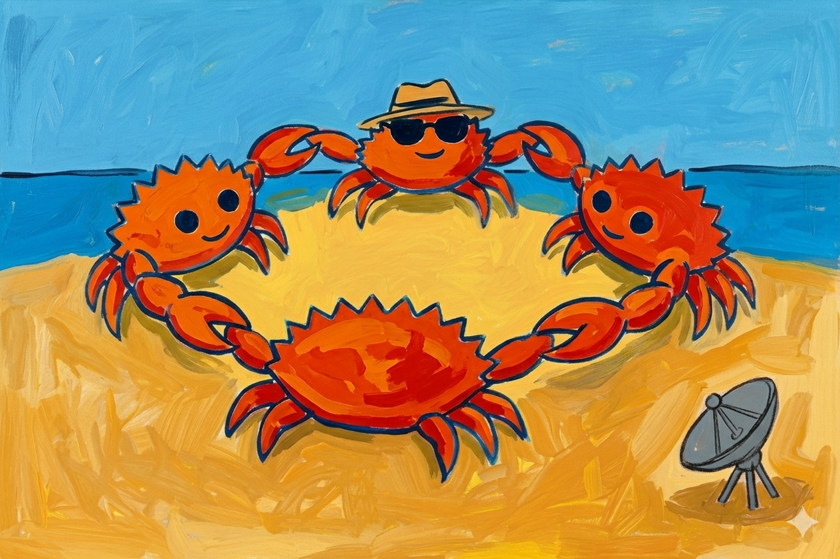

# Ciranda


A deterministic password generator written in Rust: given the same inputs, it
always produces the same password. Memorize one master seed and derive unique
passwords per context.



> A ciranda acabou de começar, e ela é!
>
> E é praieira! Segura bem forte a mão
>
> E é praieira! Vou lembrando a revolução

— Chico Science

## Usage

```bash
cargo run --release
```

The user will be prompted for:

- **seed** — a master secret, entered hidden and confirmed
- **context** — identifier for the password (e.g. `github`)
- **pass_len** — desired password length in characters (between `4` and `128`)
- **character sets** — uppercase, lowercase, digits, and/or special characters
- **Argon2 profile** — derivation cost preset (`Development`, `Standard`, or
  `Hardened`)

`seed` is the secret input and `context` separates derived passwords for
different services or accounts. Therefore, the same seed can produce different
passwords for different contexts, for example, such as `github` and `email`.

At least one character set must be selected. Unselected sets are excluded from
the generated password entirely. Use `Space` to toggle character sets and
`Enter` to confirm the selection.

## How it works

1. The **context** (e.g. a site name) is hashed with
   [BLAKE3](https://github.com/BLAKE3-team/BLAKE3)
   to produce a salt sized for Argon2id.
2. **Argon2id** enhances the **seed** (master secret) using that salt,
   producing a 64-byte key. The selected
   [Argon2](https://www.rfc-editor.org/rfc/rfc9106.html#ARGON2ESP)
   profile controls the computational cost.
3. The key is expanded into deterministic streams and used to shuffle character
   buckets and pick password characters (every selected set contributes at least
   one character).
4. The result is copied to the clipboard.

### Argon2 profiles

- **Development** — `8 KiB`, `t=1`, `p=1`; intended only for tests and fast
  local iteration
- **Standard** — `64 MiB`, `t=3`, `p=4`; the default interactive profile based
  on RFC 9106's lower-memory recommended Argon2id settings
- **Hardened** — `2 GiB`, `t=1`, `p=4`; a stronger high-memory profile based on
  RFC 9106's first recommended Argon2id settings

For library usage, password construction is configured with `PasswordSettings`,
which contains the desired length and selected `CharacterSets`. Profiles resolve
to `Argon2Settings`, which contain only the `m_cost`, `t_cost`, and `p_cost`
values Ciranda actually honors. The derived-key output length stays fixed
internally.

Changing the Argon2 profile changes the derived password, but it is not the
recommended rotation mechanism. For rotation:

- Change the **seed** for global rotation
- Change or version the **context** for service-specific rotation

## Documentation

- [Design documentation](docs/README.md)
- [Design overview](docs/design.md)
- [Roadmap](docs/roadmap/index.md)

## Dependencies

- [arboard](https://crates.io/crates/arboard) — cross-platform clipboard access
- [argon2](https://crates.io/crates/argon2) — Argon2id key derivation
- [blake3](https://crates.io/crates/blake3) — BLAKE3 hashing and
  deterministic byte streams
- [dialoguer](https://crates.io/crates/dialoguer) — interactive terminal prompts

## Disclaimer

This is a project developed with the assistance of AI agents. I am not an expert
and I am using it to learn about Rust and cryptography. Use it carefully.

The illustration was first generated using OpenAI’s GPT-5.3 multimodal model via
prompt-based image synthesis, with iterative refinements to reinterpret
Matisse’s Dance in a Manguebeat context, then it was used as input to Google's
Gemini 3 Flash Image (Nano Banana 2) to generate an image better emulating
Fauvist painting techniques.

## License

The crate is licensed under either of

 * [Apache License, Version 2.0](http://www.apache.org/licenses/LICENSE-2.0)
 * [MIT license](http://opensource.org/licenses/MIT)

at your option.

### Contribution

Unless you explicitly state otherwise, any contribution intentionally submitted
for inclusion in the work by you, as defined in the Apache-2.0 license, shall be
dual licensed as above, without any additional terms or conditions.
